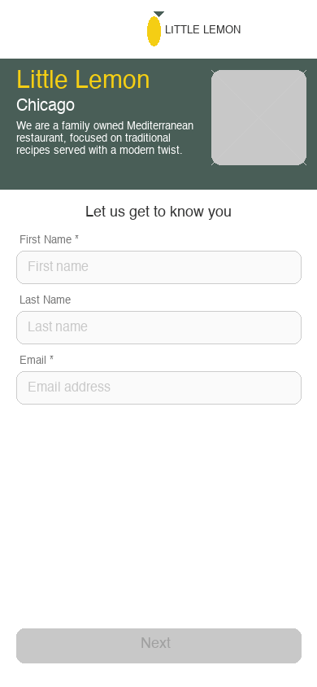

<div align="center">

# 🍋 Little Lemon

### A Mediterranean Restaurant Mobile App

*Built with React Native & Expo*



<br/>


</div>

---

## 📖 About

**Little Lemon** is a family owned Mediterranean restaurant based in Chicago, focused on traditional recipes served with a modern twist. This mobile app lets customers explore the menu, filter by category, and manage their personal profile — all wrapped in a clean, intuitive interface.

> This project was built as part of the **Meta React Native Specialization** capstone on Coursera.

---

## ✨ Features

| Feature | Description |
|---|---|
| 🚀 **Onboarding Flow** | First-time users are greeted with a registration screen. The **Next** button activates only when required fields are filled. |
| 🏠 **Home Screen** | Full-featured screen with **header**, **hero section**, **menu category filters**, and a scrollable **food menu list**. |
| 🔍 **Search & Filter** | Real-time search bar + category buttons (Starters, Mains, Desserts, Drinks) to narrow down the menu. |
| 👤 **Profile Screen** | Displays personal info collected during onboarding. Editable fields with **Save** and **Discard** actions. |
| 💾 **Persistent Storage** | Profile data is saved with `AsyncStorage` and survives app restarts. |
| 🔒 **Log Out** | Clears all stored data and returns to the Onboarding screen. |
| ⬅️ **Stack Navigation** | Full back-navigation support via React Navigation's native stack. |

---

## 📱 Screens

```
App
├── Onboarding Screen   →  First-time user registration
├── Home Screen         →  Menu browsing + search & filter
└── Profile Screen      →  Personal info management + logout
```

### 🗺 Navigation Flow

```
[First Launch]
    ↓
Onboarding ──(Next)──→ Home ──(Profile Icon)──→ Profile
                          ↑                          |
                          └──────(Log Out cleared)───┘
```

---

## 🛠 Tech Stack

- **[React Native](https://reactnative.dev/)** — Cross-platform mobile framework
- **[Expo](https://expo.dev/)** (~46) — Development toolchain & build system
- **[React Navigation](https://reactnavigation.org/)** (v6) — Native Stack Navigator
- **[@react-native-async-storage](https://react-native-async-storage.github.io/async-storage/)** — Local persistent storage
- **JavaScript (ES2020+)** — Language

---

## 🚀 Getting Started

### Prerequisites

Make sure you have the following installed:

- [Node.js](https://nodejs.org/) (v16+)
- [Expo CLI](https://docs.expo.dev/get-started/installation/)
- [Expo Go](https://expo.dev/client) app on your phone **or** an iOS/Android emulator

### Installation

```bash
# 1. Clone the repository
git clone https://github.com/your-username/littleLemonRN.git
cd littleLemonRN

# 2. Install dependencies
npm install

# 3. Start the development server
npm start
```

### Running the App

| Platform | Command |
|---|---|
| 📱 Physical device | Scan the QR code with **Expo Go** |
| 🤖 Android emulator | Press `a` in the terminal |
| 🍎 iOS simulator | Press `i` in the terminal |
| 🌐 Web | Press `w` in the terminal |

---

## 📁 Project Structure

```
littleLemonRN/
├── assets/                   # Images & icons
│   ├── little-lemon-logo.png
│   └── little-lemon-logo-grey.png
├── navigators/
│   └── RootNavigator.js      # Stack navigator + onboarding gate
├── screens/
│   ├── OnboardingScreen.js   # Registration screen (first launch)
│   ├── HomeScreen.js         # Menu browsing screen
│   └── ProfileScreen.js      # Profile management screen
├── utils/
│   └── index.js              # Helper utilities (e.g. email validation)
├── App.js                    # App entry point
└── package.json
```

---

## 🎨 Design

The app follows the **Little Lemon** brand guidelines:

| Token | Value |
|---|---|
| Primary Green | `#495E57` |
| Highlight Yellow | `#F4CE14` |
| Background | `#FFFFFF` |
| Text Dark | `#333333` |
| Text Muted | `#777777` |

---

## 📋 Checklist

- [x] Wireframe-based screen design
- [x] Onboarding screen on first launch
- [x] Next button enabled only when details are entered
- [x] Home screen with header, hero, menu breakdown & food list
- [x] Profile screen populated with onboarding data
- [x] Profile changes retained after app restart
- [x] Log out clears all profile data
- [x] Stack navigation with Back button support
- [x] Hero section with description and search bar
- [x] Menu breakdown with selectable categories
- [x] Food menu list with name, description, and price

---

## 📄 License

This project is for **educational purposes** as part of the Meta React Native Specialization on Coursera.

---

<div align="center">

Made with ❤️ and 🍋 by **Little Lemon Chicago**

</div>
